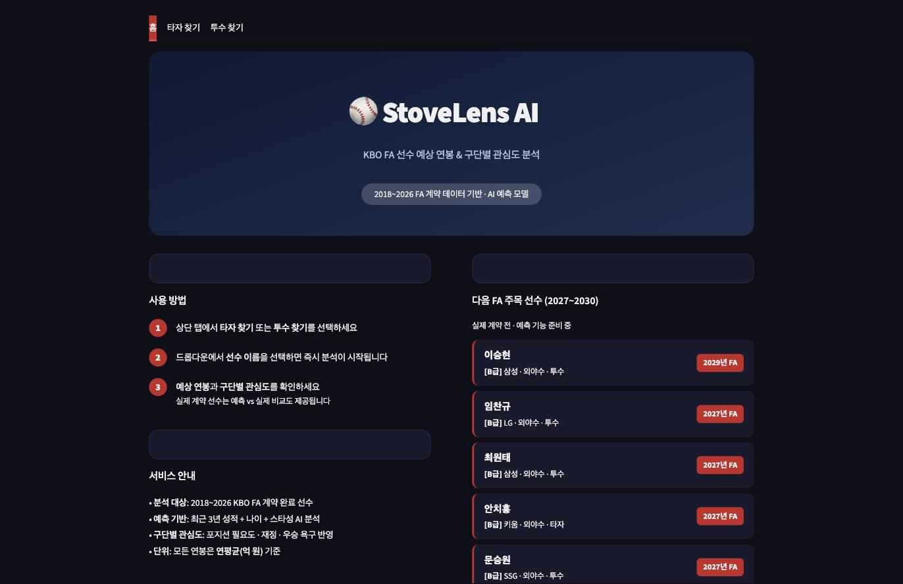
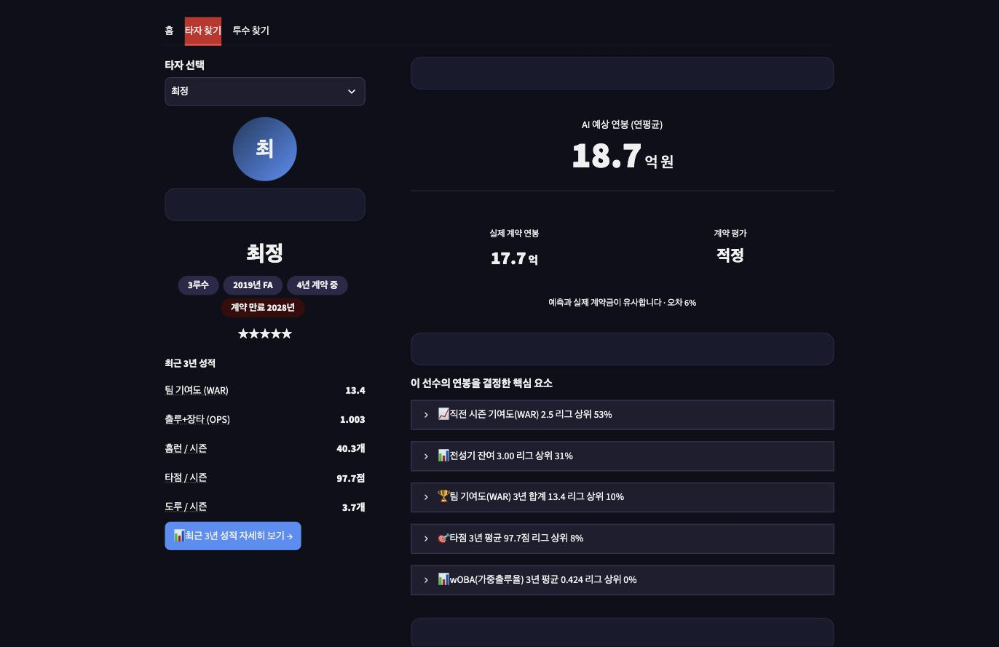

# ⚾ StoveLens AI (SalaryCast AI) — KBO FA 연봉 예측 서비스

KBO 프리에이전트(FA) 선수의 최근 성적 데이터를 기반으로 예상 연평균 계약금을 예측하고,
구단별 적정 제시가를 추천하는 머신러닝 프로젝트입니다.
2015~2026년 네이버 스포츠 KBO 시즌 통계를 수집하고, FA 계약 데이터와 결합하여 학습 데이터를 구성한 뒤,
XGBoost 기반 예측 모델과 Streamlit 시연 서비스로 이어집니다.

[](https://github.com/jjssspark/SalaryCast_AI/actions/workflows/ci.yml)

---

## 📸 스크린샷

| 홈 화면 | 선수 상세 (예측 결과) |
|---|---|
|  |  |

> 배포 링크: _(Streamlit Community Cloud 배포 후 갱신 예정)_

---

## 📁 프로젝트 구조

```
SalaryCast_AI/
├── app/
│   └── app.py                 # Streamlit 엔트리포인트 (얇은 라우팅만 담당)
├── src/                        # 앱 핵심 로직 모듈
│   ├── constants.py            # 팀 데이터·툴팁 등 상수
│   ├── data_loader.py          # 데이터/모델 로딩 (+ 실패 시 에러 핸들링)
│   ├── features.py             # 피처 엔지니어링
│   ├── predict.py              # 연봉 예측 (XGBoost/LightGBM 앙상블)
│   ├── team_offers.py          # 구단별 제시가 보정 로직
│   └── ui/                     # 화면 렌더링 (홈/검색/상세 페이지, 스타일)
├── tests/                       # pytest 단위 테스트
├── data/                        # 원본·정제·학습용 CSV
├── models/                      # 학습된 모델(.pkl)
├── notebooks/                    # 데이터 수집·전처리·모델 학습 노트북
└── scripts/                      # 크롤링·유틸 스크립트
```

---

## ⚙️ 주요 기능

### 1. 데이터 수집
- 네이버 스포츠 API에서 KBO 선수 시즌 통계 수집 (2015~2026)
- 타자 / 투수 구분 수집, 국내 선수 필터링
- FA 계약 뉴스 기사 파싱을 통한 계약 금액 추출 (140건)

### 2. 학습 데이터 생성
- FA 계약 연도 기준 **직전 3개년 시즌 통계** 집계
- 타자 / 투수 포지션별 학습 데이터셋 분리 생성
- 스타성 지표(MVP·골든글러브·국가대표 등), 투수 역할(SP/SU/CL) 피처 추가

### 3. 연봉 예측 모델
- 타자 / 투수 분리 학습 (선형회귀 → 랜덤포레스트 → XGBoost/LightGBM 앙상블)
- 교차검증·하이퍼파라미터 튜닝, SHAP 기반 피처 중요도 분석
- 평가지표: R², MSE, RMSE

### 4. Streamlit 시연 서비스
- 선수 검색 → AI 예상 연봉 + 예측 근거(핵심 요소) 표시
- 과거 FA 완료 선수: 실제 계약 vs 예측 비교
- 미래 FA 예정 선수: 구단별 적정 제시가 추천

---

## 🛠️ 기술 스택

| 분류 | 기술 |
|------|------|
| 언어 | Python 3.13 |
| 데이터 처리 | pandas, numpy |
| 머신러닝 | scikit-learn, XGBoost, LightGBM, SHAP |
| 웹 서비스 | Streamlit, Plotly |
| 데이터 수집 | requests, BeautifulSoup |
| 테스트 / CI | pytest, ruff, GitHub Actions |

---

## 🚀 설치 및 실행

```bash
# 저장소 클론
git clone https://github.com/jjssspark/SalaryCast_AI.git
cd SalaryCast_AI

# 가상환경 생성 및 의존성 설치
python3 -m venv .venv
source .venv/bin/activate
pip install -r requirements.txt
```

### Streamlit 앱 실행

```bash
streamlit run app/app.py
```

### 테스트 실행

```bash
pytest tests/ -v
```

### 데이터 파이프라인 재현 (노트북 실행 순서)

```
1. data_collect_test.ipynb       — 네이버 KBO 선수 통계 수집
2. fa_contract_collect.ipynb     — FA 계약 데이터 수집
3. make_training_dataset.ipynb   — 학습 데이터셋 생성
4. clean_model_train.ipynb       — 모델 학습·평가·SHAP 분석
```

---

## 📊 데이터 파이프라인

```
네이버 KBO API (2015~2026)
        ↓
시즌 통계 수집 (타자 / 투수)
        ↓
FA 계약 데이터 매핑 (140건)
        ↓
직전 3개년 통계 집계 + 스타성/역할 피처 추가
        ↓
타자 / 투수 학습 데이터셋 생성
        ↓
XGBoost/LightGBM 앙상블 예측 모델
        ↓
Streamlit 서비스 (선수 검색 → 예상 연봉 → 구단별 제시가)
```
