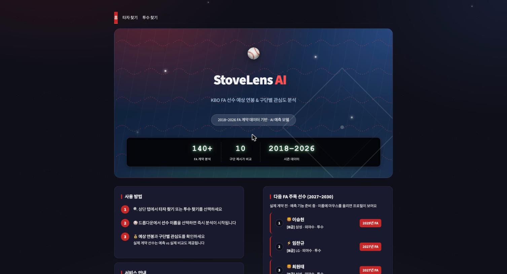
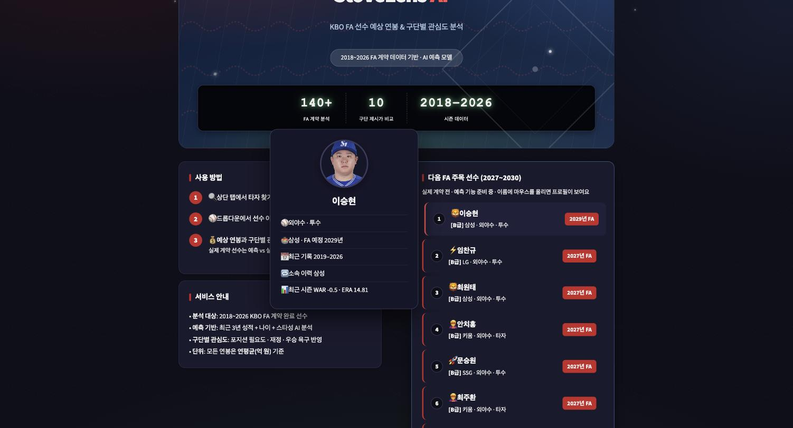
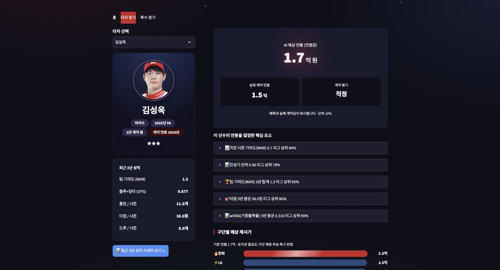
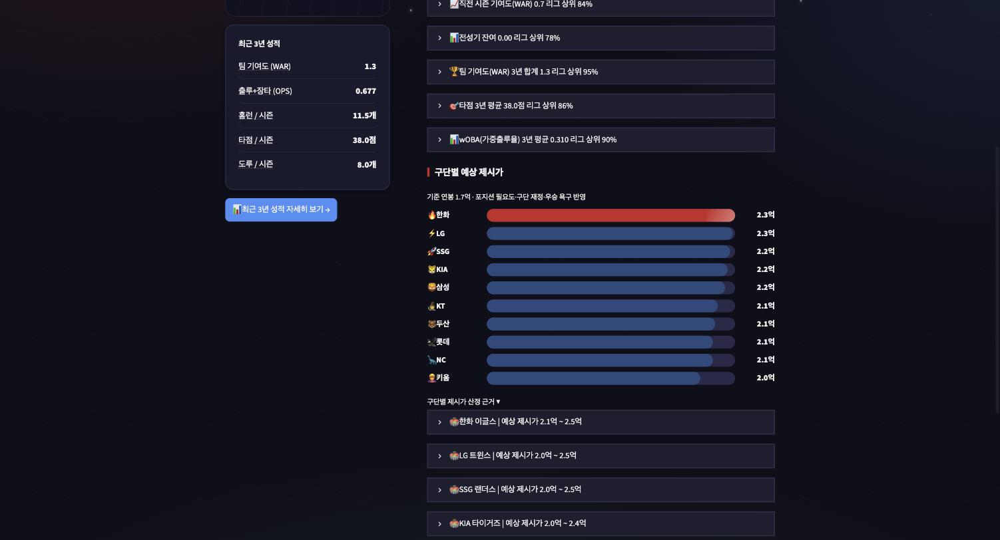
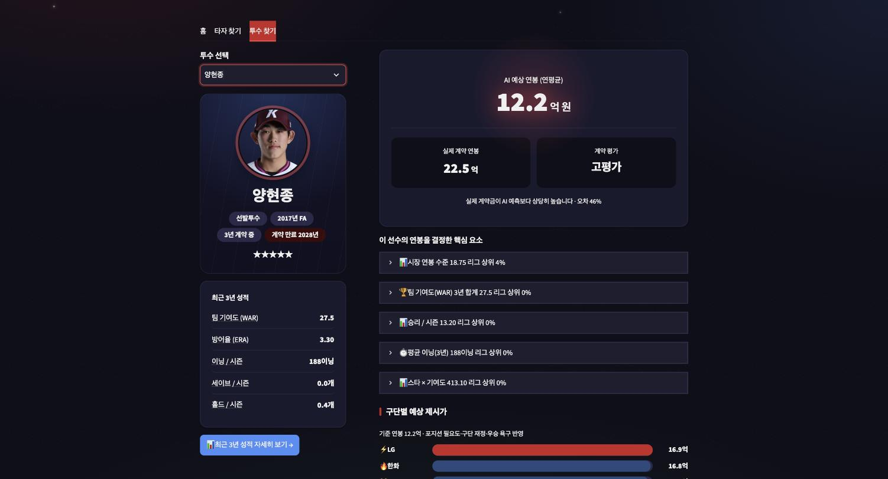
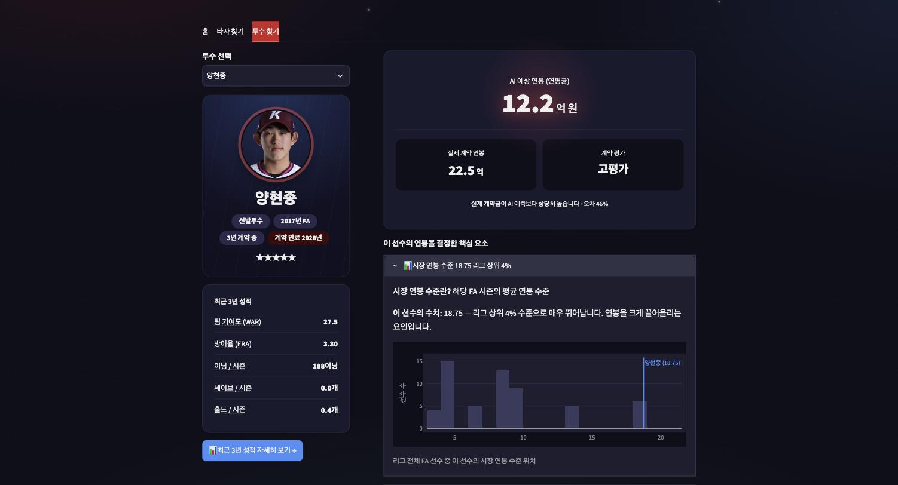
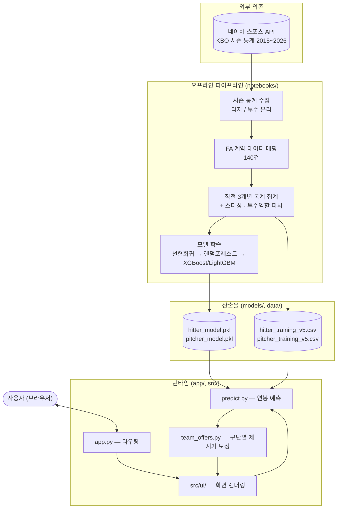

# ⚾ StoveLens AI (SalaryCast AI) — KBO FA 연봉 예측 서비스

KBO 프리에이전트(FA) 선수의 최근 성적 데이터를 기반으로 예상 연평균 계약금을 예측하고,
구단별 적정 제시가를 추천하는 머신러닝 프로젝트입니다.
2015~2026년 네이버 스포츠 KBO 시즌 통계를 수집하고, FA 계약 데이터와 결합하여 학습 데이터를 구성한 뒤,
XGBoost 기반 예측 모델과 Streamlit 시연 서비스로 이어집니다.

[](https://github.com/jjssspark/SalaryCast_AI/actions/workflows/ci.yml)

---

## 🎬 데모


선수 검색 → AI 예상 연봉 → 실제 계약 비교 → 구단별 제시가까지 이어지는 핵심 플로우입니다.
고화질 원본은 [docs/video/salarycast_demo.mp4](docs/video/salarycast_demo.mp4)에서 다운로드해 볼 수 있습니다.

---

## 📸 스크린샷

| 홈 화면 | FA 카드 호버 프로필 |
|---|---|
|  |  |

| 타자 상세 (실제 vs 예측 비교) | 구단별 예상 제시가 |
|---|---|
|  |  |

| 투수 상세 (고평가 판정) | 예측 근거 상세 |
|---|---|
|  |  |

> 🔗 배포 링크: **[stovelens-ai.streamlit.app](https://stovelens-ai.streamlit.app/)**

---

## 📁 프로젝트 구조

```
SalaryCast_AI/
├── app/
│   └── app.py                 # Streamlit 엔트리포인트 (얇은 라우팅만 담당)
├── src/                        # 앱 핵심 로직 모듈
│   ├── constants.py            # 팀 데이터·툴팁 등 상수
│   ├── data_loader.py          # 데이터/모델 로딩 (+ 실패 시 에러 핸들링)
│   ├── features.py             # 피처 엔지니어링
│   ├── predict.py              # 연봉 예측 (XGBoost/LightGBM 앙상블)
│   ├── team_offers.py          # 구단별 제시가 보정 로직
│   └── ui/                     # 화면 렌더링 (홈/검색/상세 페이지, 스타일)
├── tests/                       # pytest 단위 테스트
├── data/                        # 원본·정제·학습용 CSV
├── models/                      # 학습된 모델(.pkl)
├── notebooks/                    # 데이터 수집·전처리·모델 학습 노트북
└── scripts/                      # 크롤링·유틸 스크립트
```

---

## ⚙️ 주요 기능

### 1. 데이터 수집
- 네이버 스포츠 API에서 KBO 선수 시즌 통계 수집 (2013~2026, 타자 1,273명 / 투수 954명)
- 정렬 기준 여러 개로 순회 + 페이지네이션 — 한 기준만 쓰면 출전이 적은 선수가 통째로 빠짐 (TS-001)
- 진행 중인 2026 시즌은 누적 스탯을 시즌 환산해서 사용
- FA 계약 뉴스 기사 파싱을 통한 계약 금액 추출 (140건)

### 2. 학습 데이터 생성
- FA 계약 연도 기준 **직전 3개년 시즌 통계** 집계
- 타자 / 투수 포지션별 학습 데이터셋 분리 생성
- 스타성 지표(MVP·골든글러브·국가대표 등), 투수 역할(SP/SU/CL) 피처 추가

### 3. 연봉 예측 모델
- 타자 / 투수 분리 학습 (선형회귀 → 랜덤포레스트 → XGBoost/LightGBM 앙상블)
- 교차검증·하이퍼파라미터 튜닝, SHAP 기반 피처 중요도 분석
- 평가지표: R², MSE, RMSE

### 4. Streamlit 시연 서비스
- 이름·초성으로 **시즌 기록이 있는 1,854명 전체** 검색 (`ㅂㄷㅇ` → 박동원)
- 검색 결과에 따라 화면이 세 갈래로 자동 분기
  - **FA 완료** — 실제 계약 vs 예측 비교, 고평가/적정/저평가 판정
  - **FA 예정** — 예상 연봉 + 구단별 제시가 (포지션 필요도·우승 의지·재정 여력 반영)
  - **일반 현역** — FA가 온다면 얼마일지 참고값
- 표본이 모자라면 숫자를 내지 않고 이유를 표시 (타자 50타수 / 투수 20이닝 미만)
- 모든 스탯을 리그 주전 표본과 견줘 상위 몇 %인지 함께 표기
- R²·RMSE·모델 이름 등 기술 용어는 `분석 상세` 토글 안에만 노출

---

## 📈 모델 성능

표본이 적어(타자 93명·투수 46명) 단일 train/test 분할 대신 **5-fold 교차검증을 5회 반복한 OOF(Out-of-Fold)** 예측으로 평가했습니다. 연봉은 log 변환 후 학습해 큰 값 쪽으로 쏠리는 것을 완화했고, **지표는 다시 억 원 단위로 되돌려** 계산했습니다. 로그 공간의 R²는 실제 오차 감각과 다릅니다.

| 대상 | 최종 모델 | R² | RMSE | MAE | 표본 |
|---|---|---|---|---|---|
| 타자 | XGBoost 0.60 + Ridge 0.40 | 0.541 | 4.96억 | 3.48억 | 93명 |
| 투수 | LightGBM 0.55 + Ridge 0.45 | 0.677 | 2.64억 | 2.05억 | 46명 |

이전 수치(타자 0.507 / 투수 0.410)는 아래 네 가지를 고친 뒤 다시 측정한 값입니다.

1. **타깃 누수 제거** — `market_level`이 같은 해 FA 계약 연봉의 중앙값이라 정답을 흘리고 있었습니다. 직전 3개 연도만 보도록 바꿨습니다. 제거 비용은 거의 없었습니다(`output/reports/leakage_ablation.md`).
2. **수집 누락 복구** — 시즌당 선수의 30%만 수집되고 있었습니다. 타자 604명→1,273명, 투수 794명→954명 (TS-001).
3. **생년 교정** — FA 계약 원본의 생년이 54건 틀려 나이 피처가 오염돼 있었습니다. 최대 8년 차이 (TS-002).
4. **스타성 재수집** — MVP·골든글러브 값이 출처 없이 손으로 적혀 있었고 상당수가 사실과 달랐습니다(오승환 골든글러브 7회로 기재, 실제 0회 — 투수 골든글러브는 한 해 한 명뿐). 연도별 수상자 명단에서 다시 만들어 140명이 아닌 전 선수를 덮습니다 (TS-004).

> 4번은 지표를 **떨어뜨렸습니다**(투수 0.718→0.677). 옛 값이 더 잘 맞은 이유는 정확해서가 아니라, 결과를 아는 사람이 적어 넣은 숫자라 정답과 상관됐기 때문입니다. 게다가 FA 계약자 140명분만 있어 화면에서 다른 선수를 검색하면 전부 0이 들어갑니다. 서비스에서 못 쓰는 피처로 올린 점수라 되돌리지 않았습니다.

예측 근거는 SHAP으로 **선수 한 명 단위**로 계산합니다. 전체 피처 중요도를 쓰면 누구를 검색하든 같은 순서가 나오기 때문입니다. 시즌 선택 규칙과 비율 스탯 가중 방식 4개 조합의 전수 비교는 `TROUBLESHOOTING.md` TS-003에 남아 있습니다.

---

## 🛠️ 기술 스택

| 분류 | 기술 | 왜 골랐는가 |
|------|------|------|
| 언어 | Python 3.13 | 데이터 수집·모델링·서비스를 한 언어로 끊김 없이 연결 |
| 데이터 처리 | pandas, numpy | 시즌 스탯·FA 계약 데이터의 표 형태 가공에 표준 |
| 머신러닝 | scikit-learn, XGBoost, LightGBM, SHAP | 선형회귀 베이스라인 → 트리 앙상블로 단계적 고도화, SHAP으로 예측 근거 설명 |
| 웹 서비스 | Streamlit, Plotly | 파이썬 모델 코드와 분리된 API 서버 없이 바로 시연 서비스로 연결 ([ADR-06](docs/ADR.md) 참고) |
| 데이터 수집 | requests, BeautifulSoup | 네이버 스포츠 API 직접 호출 + FA 계약 기사 파싱에 충분히 가벼움 |
| 테스트 / CI | pytest, ruff, GitHub Actions | 커밋마다 회귀 확인, 별도 인프라 없이 GitHub에서 바로 동작 |

---

## 🚀 설치 및 실행

```bash
# 저장소 클론
git clone https://github.com/jjssspark/SalaryCast_AI.git
cd SalaryCast_AI

# 가상환경 생성 및 의존성 설치
python3 -m venv .venv
source .venv/bin/activate
pip install -r requirements.txt
```

### Streamlit 앱 실행

```bash
streamlit run app/app.py
```

### 테스트 실행

```bash
pytest tests/ -v
```

### 데이터 파이프라인 재현 (노트북 실행 순서)

```
1. data_collect_test.ipynb       — 네이버 KBO 선수 통계 수집
2. fa_contract_collect.ipynb     — FA 계약 데이터 수집
3. make_training_dataset.ipynb   — 학습 데이터셋 생성
4. clean_model_train.ipynb       — 모델 학습·평가·SHAP 분석
```

---

## 📊 아키텍처 & 데이터 파이프라인


```mermaid
flowchart TD
    subgraph external["외부 의존"]
        naver[("네이버 스포츠 API<br/>KBO 시즌 통계 2015~2026")]
    end

    subgraph offline["오프라인 파이프라인 (notebooks/)"]
        collect["시즌 통계 수집<br/>타자 / 투수 분리"]
        fa["FA 계약 데이터 매핑<br/>140건"]
        agg["직전 3개년 통계 집계<br/>+ 스타성 · 투수역할 피처"]
        train["모델 학습<br/>선형회귀 → 랜덤포레스트 → XGBoost/LightGBM"]
    end

    subgraph models["산출물 (models/, data/)"]
        pkl[("hitter_model.pkl<br/>pitcher_model.pkl")]
        csv[("hitter_training_v5.csv<br/>pitcher_training_v5.csv")]
    end

    subgraph runtime["런타임 (app/, src/)"]
        app["app.py — 라우팅"]
        predict["predict.py — 연봉 예측"]
        offers["team_offers.py — 구단별 제시가 보정"]
        ui["src/ui/ — 화면 렌더링"]
    end

    user(["사용자 (브라우저)"])

    naver --> collect --> fa --> agg --> train
    train --> pkl
    agg --> csv
    pkl --> predict
    csv --> predict
    app --> ui
    ui --> predict --> offers --> ui
    user <--> app
```

- **개발 환경**: `notebooks/`에서 노트북 실행 순서(①~④)대로 재현하며 로컬 CSV·pkl 파일을 직접 다룬다.
- **배포 환경**: Streamlit 앱은 `models/`, `data/`에 이미 커밋된 학습 결과물(.pkl/.csv)만 읽는다 — 배포 서버에서 재학습하지 않는다. 네이버 API는 오프라인 수집 단계에서만 호출되고, 런타임에는 선수 사진 조회(`get_player_photo`) 시 다시 호출된다.

---

## 🧭 트러블슈팅 & 설계 결정

**트러블슈팅 3줄 요약** ([전체 기록 →](docs/TROUBLESHOOTING.md))
- Streamlit의 `st.markdown` 호출은 매번 독립된 DOM 엘리먼트로 렌더링돼, 여러 호출로 나눠 그린 카드가 빈 박스로 깨지는 게 근본 원인이었다.
- 선수 사진이 안 뜨는 문제는 "네트워크 차단"이라는 첫 가설이 틀렸고, 실제로는 API 파라미터명 변경·응답 키 변경·`pageSize` 부족·CDN Referer 차단 네 가지가 겹친 문제였다.
- 코드를 고쳐도 화면이 그대로였던 건 Streamlit `runOnSave` 미설정과, 그 알림 배너를 가리던 커스텀 CSS가 겹친 환경 문제였다.

**ADR 3줄 요약** ([전체 기록 →](docs/ADR.md))
- 투수 역할(SP/SU/CL)은 표본이 너무 적어 모델 3개로 쪼개는 대신 `pitcher_role` 단일 피처로 통합했다.
- 타자/투수 모델을 완전히 분리 학습하고, 총액·계약기간 등 데이터 누수 컬럼을 학습 피처에서 제외했다.
- 1차 연봉 예측(XGBoost/LightGBM)과 2차 구단별 제시가 보정(도메인 규칙)을 분리해서 설계했다.

**프로젝트 회고 및 진행 기록**: [Notion →](https://app.notion.com/p/SalaryCast_AI-00af6f1e619a82c4b882016d34088dd1?source=copy_link)
